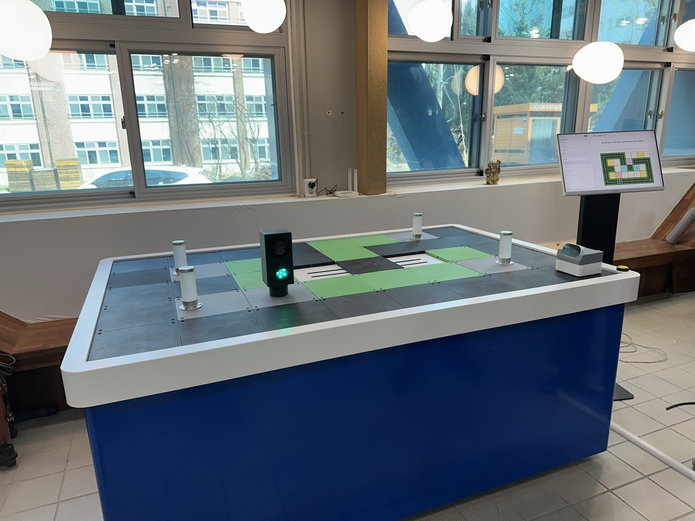
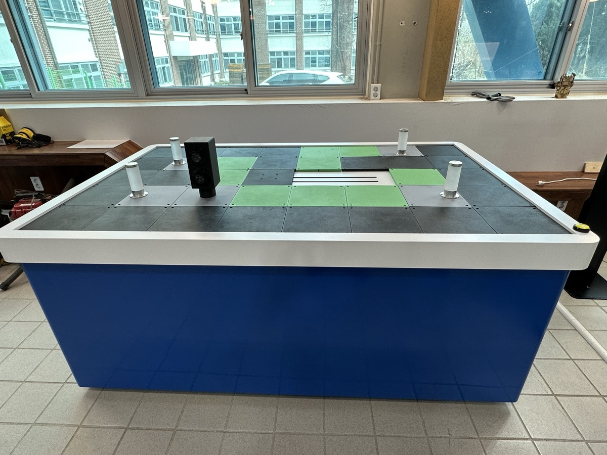
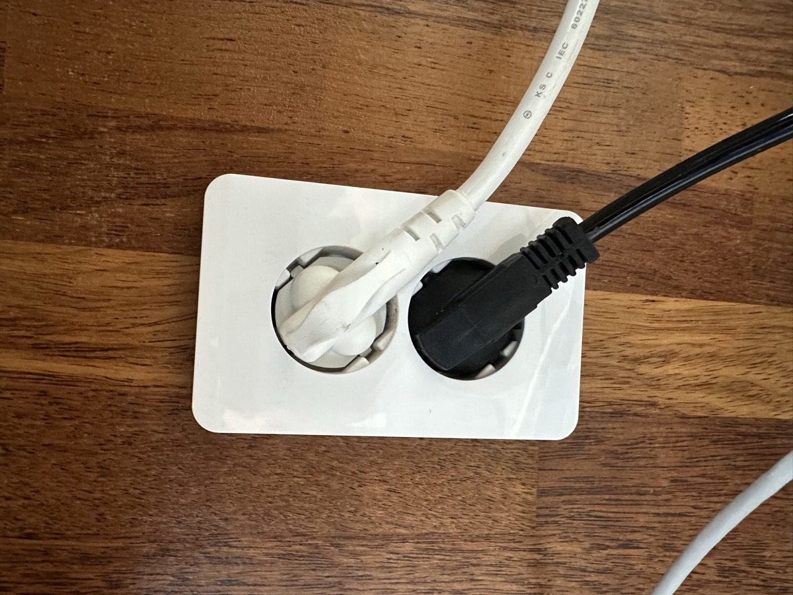
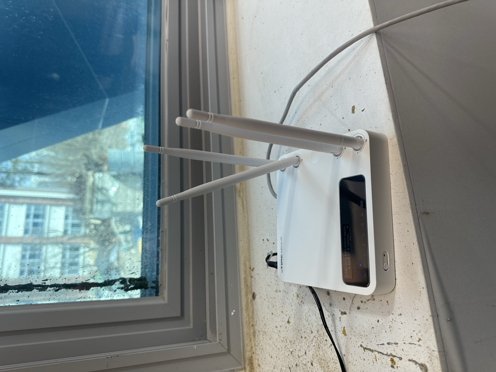
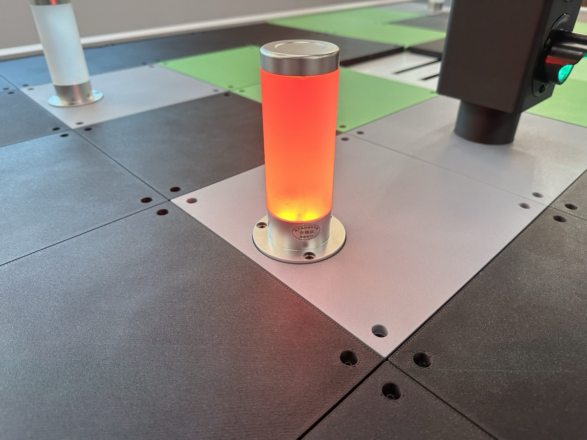
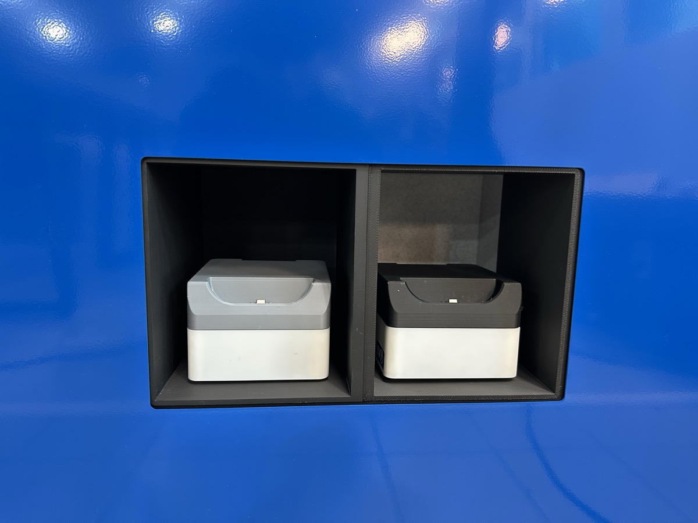
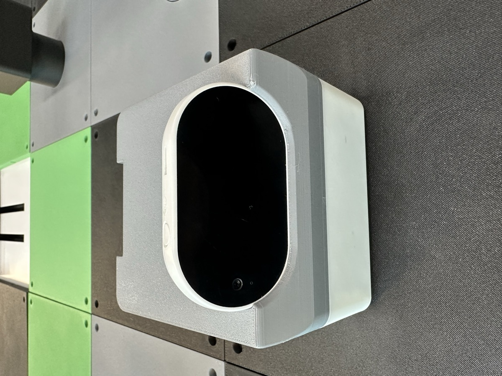

# 휴닛 스마트 시티

휴닛 스마트 시티는 학생들이 직접 코딩한 명령에 따라 **모바일 로봇이 도시 위를 주행**하며 다양한 미션을 수행하는 교육용 플랫폼입니다.

모바일 로봇에 장착된 **AI 카메라**를 활용하여 도시 환경을 인식하고, 사용자가 작성한 코드에 따라 자율적으로 움직이며 미션을 완수합니다.

<figure><figcaption>
휴닛 스마트 시티 전체 구성
</figcaption></figure>

---

## 스마트 시티 스펙

### 시티

| 구성품 | 수량 |
| --- | --- |
| 모바일 로봇 (AI 카메라 포함) | 2대 |
| 미션 렘프 | 4개 |
| 신호등 | 1개 |
| 스테이션 디바이스 | 1개 |
| 리니어 벨트 | 1개 |
| 와이파이 공유기 | 1개 |

<figure><figcaption>
스마트 시티 테이블 정면
</figcaption></figure>

### 키오스크

| 구성품 | 수량 |
| --- | --- |
| 터치 모니터 | 1개 |
| 미니 PC | 1개 |

<figure><figcaption>
키오스크 - 터치 모니터를 통해 코딩 및 제어
</figcaption></figure>

### 크기

_추후 업데이트 예정_

---

## 전원 및 네트워크

총 **두 개의 전원 케이블**을 콘센트에 연결하면 자동으로 전원이 켜집니다.

<figure><figcaption>
검정색, 흰색 두 개의 전원 케이블을 연결
</figcaption></figure>

모바일 로봇을 포함한 모든 장치는 **와이파이**로 통신하며 동작합니다.

<figure><figcaption>
와이파이 공유기
</figcaption></figure>


인터넷이 연결되어 있으면 소프트웨어가 **자동으로 업데이트**됩니다. 안정적인 인터넷 연결을 항상 유지해 주세요.


---

## 초기 세팅


사용 전 반드시 아래 초기 세팅을 확인해 주세요.


1. **리니어 벨트**를 신호등 쪽으로 밀어놓습니다.
2. 전원을 연결하면 **미션 렘프 및 신호등이 잠시 깜빡**입니다. 깜빡임이 끝나면 정상 작동 상태입니다.

---

## 맵 색상 안내

| 색상 | 의미 |
| --- | --- |
| **검은색** | 도로 (모바일 로봇 주행 구간) |
| **회색** | 모듈이 올라가는 자리 |
| **녹색** | 차도 아님 (주행 불가 구간) |

---

## 미션 렘프

미션 렘프는 미션의 진행 상태를 색상으로 표시합니다.

| 색상 | 상태 |
| --- | --- |
| 🟢 **초록** | 미션 성공 |
| 🟠 **주황** | 미션 실행 중 |
| 🔴 **빨강** | 미션 실패 |

<figure><figcaption>
미션 성공 시 초록색으로 점등
</figcaption></figure>

<figure><figcaption>
미션 실행 중 주황색으로 점등
</figcaption></figure>

<figure><figcaption>
미션 실패 시 빨간색으로 점등
</figcaption></figure>

---

## 모바일 로봇

모바일 로봇은 사용자가 코딩한 명령에 따라 스마트 시티 위를 주행합니다.

<figure><figcaption>
모바일 로봇 (AI 카메라 장착 상태)
</figcaption></figure>

### 구성 요소

<figure><figcaption>
충전 단자, 리셋 버튼, C타입 단자 위치
</figcaption></figure>

* **충전 단자** — 충전 도크에 거치하여 충전
* **리셋 버튼** — 와이파이 연결 확인 용도 (깜빡임이 끝나면 연결 완료)
* **C타입 단자** — 개발자용

### 충전

<figure><figcaption>
모바일 로봇 충전 도크 (테이블 측면)
</figcaption></figure>

<figure><figcaption>
모바일 로봇 2대가 충전 도크에 거치된 모습
</figcaption></figure>


충전 시 반드시 **AI 카메라를 분리한 후** 충전해 주세요. 카메라를 장착한 채로 충전하면 **발열**이 발생할 수 있습니다.


### AI 카메라 장착

<figure><figcaption>
AI 카메라 장착 방법
</figcaption></figure>

<figure><figcaption>
AI 카메라 슬롯 (빈 상태)
</figcaption></figure>


카메라를 끼울 때 반드시 **꽉 끼워주세요.** 대부분의 문제가 카메라가 제대로 장착되지 않아서 발생합니다.


---

## 사용법

### 사용 전 확인사항

* AI 카메라가 모바일 로봇에 **꽉 끼워져** 있는지 확인
* 리니어 벨트가 **신호등 쪽으로 밀려있는지** 확인

### 사용 후

* AI 카메라를 **빼서** 보관 (충전 시 발열 방지)

### 리니어 벨트 문제 발생 시


1. 전원을 분리합니다.
2. 잠시 기다립니다.
3. 리니어 벨트를 **초기 세팅 위치**(신호등 쪽)로 밀어놓습니다.
4. 전원을 다시 연결합니다.


### Step 1

_추후 업데이트 예정_

### Step 2

_추후 업데이트 예정_

### Step 3

_추후 업데이트 예정_

### Step 4

_추후 업데이트 예정_
